---
### 👉作者QQ ：1556708905 微信：zheng0123Long (支持修改、部署调试、定制毕设)

### 👉接网站建设、小程序、H5、APP、各种系统等

### 👉选题+开题报告+任务书+程序定制+安装调试+ppt 都可以做
---

**毕业设计所有选题地址 [https://github.com/zhengjianzhong0107/allProject](https://github.com/zhengjianzhong0107/allProject)**

**博客地址：[https://blog.csdn.net/2303_76227485/article/details/128650648](https://blog.csdn.net/2303_76227485/article/details/128650648)**

**视频演示：[https://space.bilibili.com/384537280](https://space.bilibili.com/384537280)**

# SpringBoot网上商城(源代码+数据库)

## 一、系统介绍

前台商城系统：包含首页登录、商品分类、新品上线、首页轮播、商品推荐、商品搜索、商品展示、购物车、订单结算、订单流程、个人订单管理、会员中心、帮助中心等模块。 

后台管理系统：包含数据面板、轮播图管理、商品管理、订单管理、会员管理、分类管理、设置等模块。

## 二、所用技术

- 后台：Springboot + Mybatis + Swagger2 + Maven +mysql
  
  前台：Thymeleaf + Bootstrap + AdminLTE

## 三、环境介绍

基础环境 :IDEA/eclipse, JDK 1.8, Mysql5.7,Maven

源码+数据库脚本

所有项目以及源代码本人均调试运行无问题 可支持远程调试运行

## 四、页面截图

以下为商城项目的部分页面，不一一列举，重要节点及重要功能的页面都已整理在下方，如想看项目全部可以自行下载运行。

#### 前台商城页面

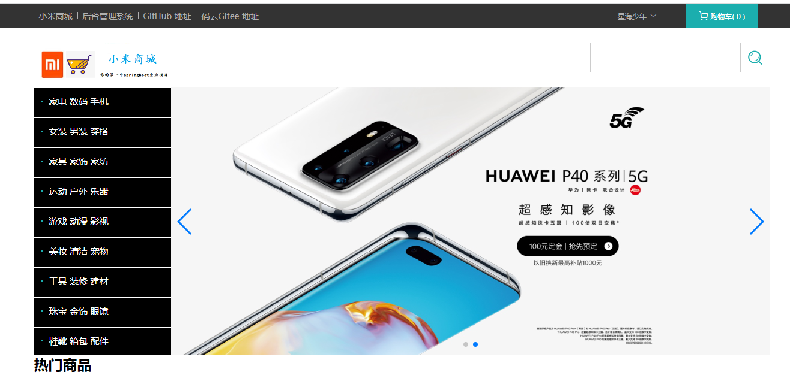

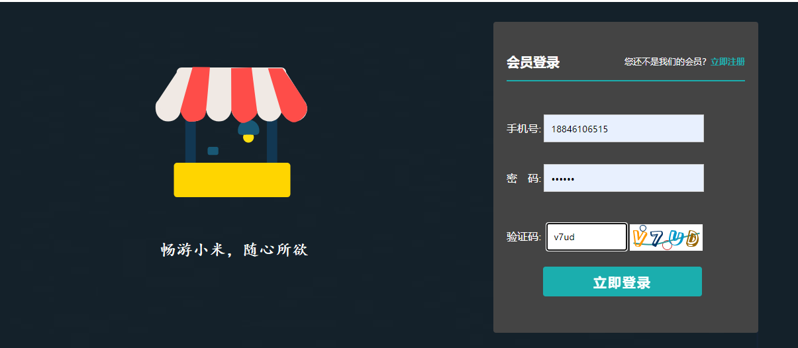

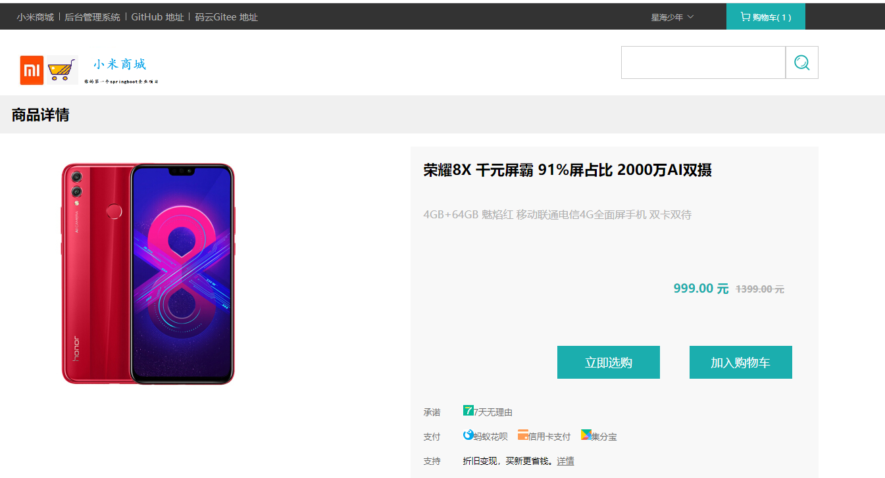

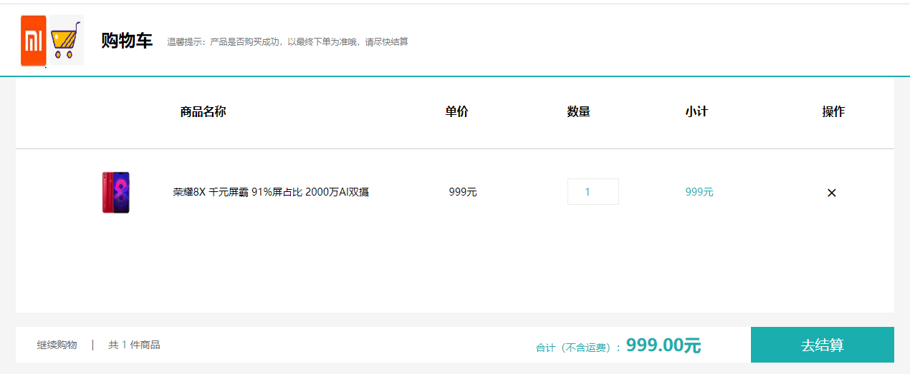

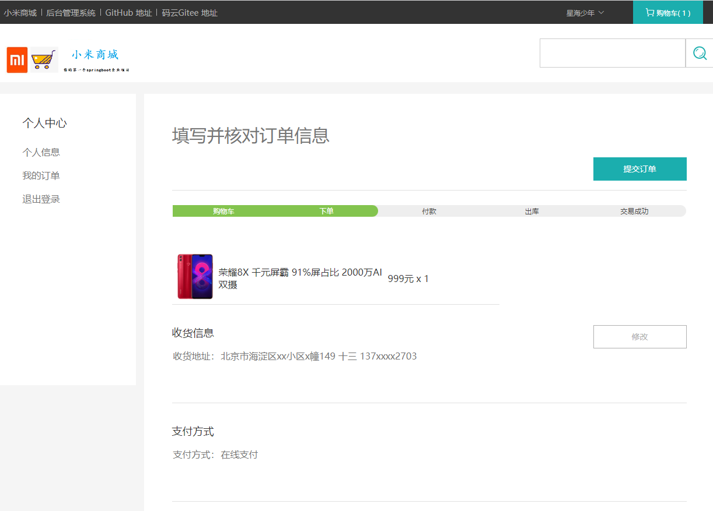

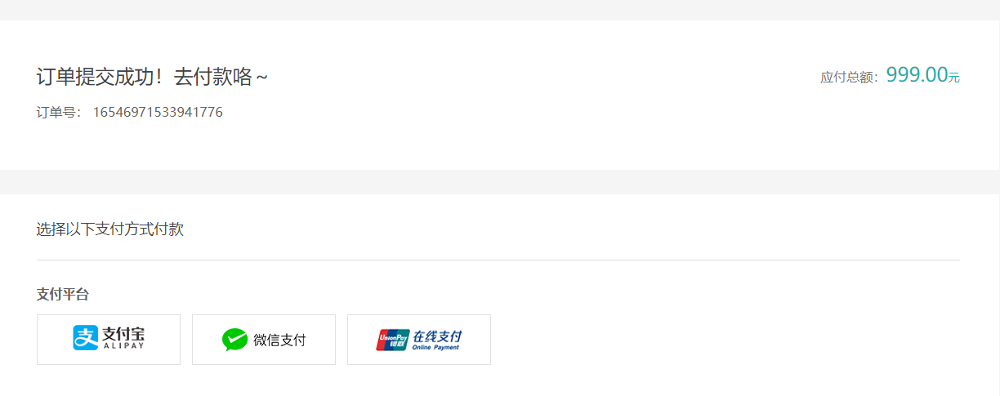

#### 后台管理页面

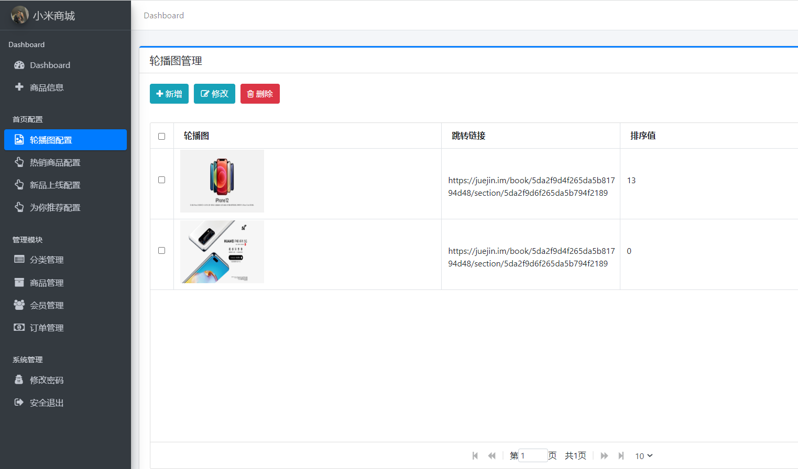

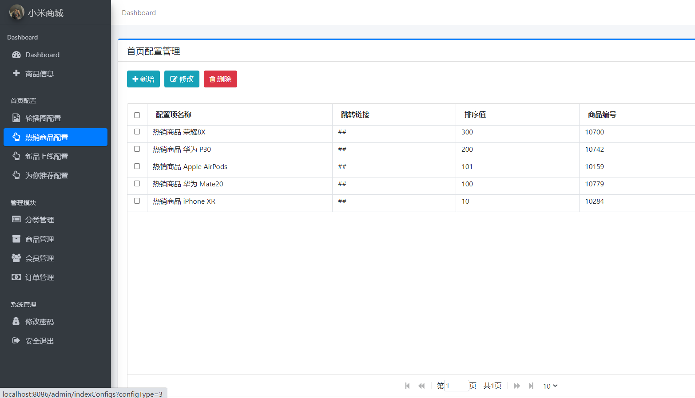

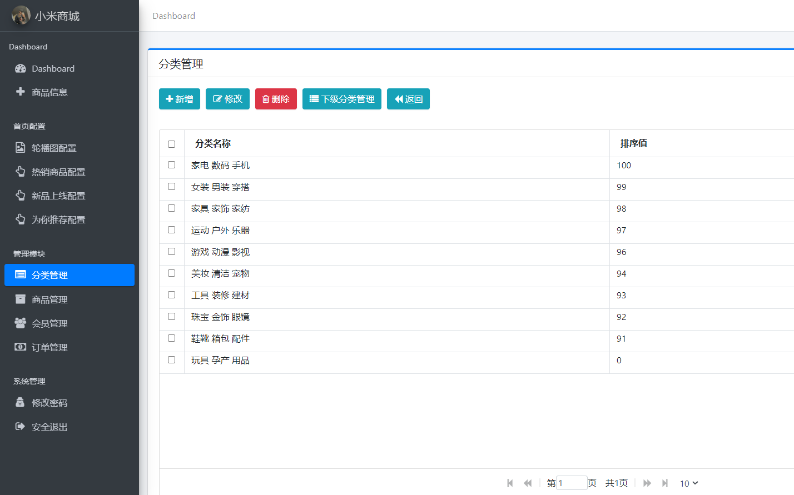

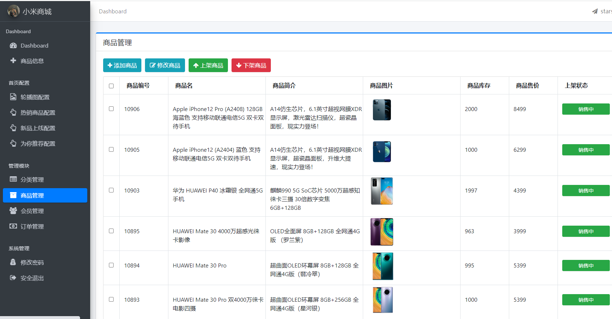

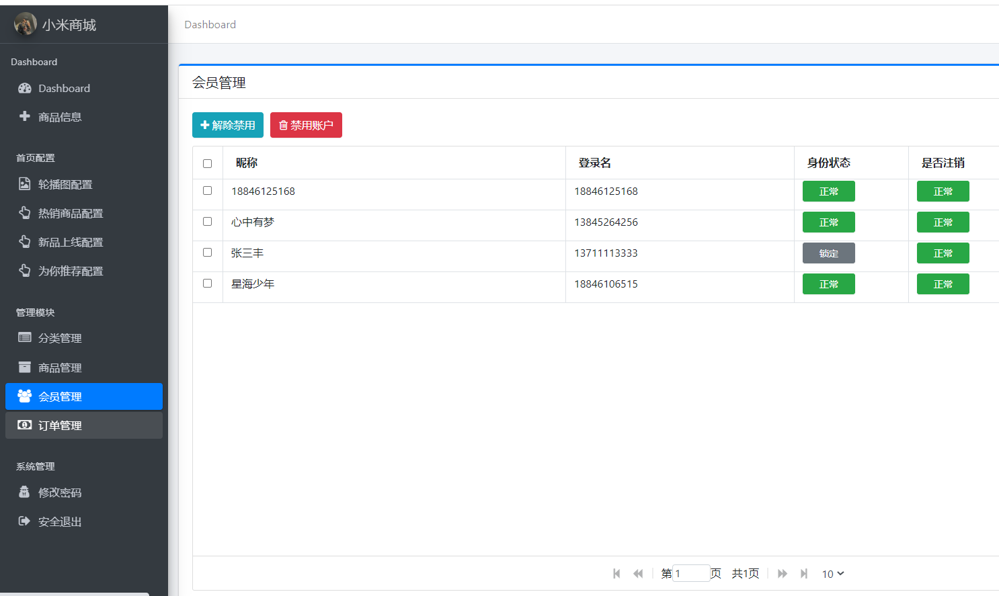

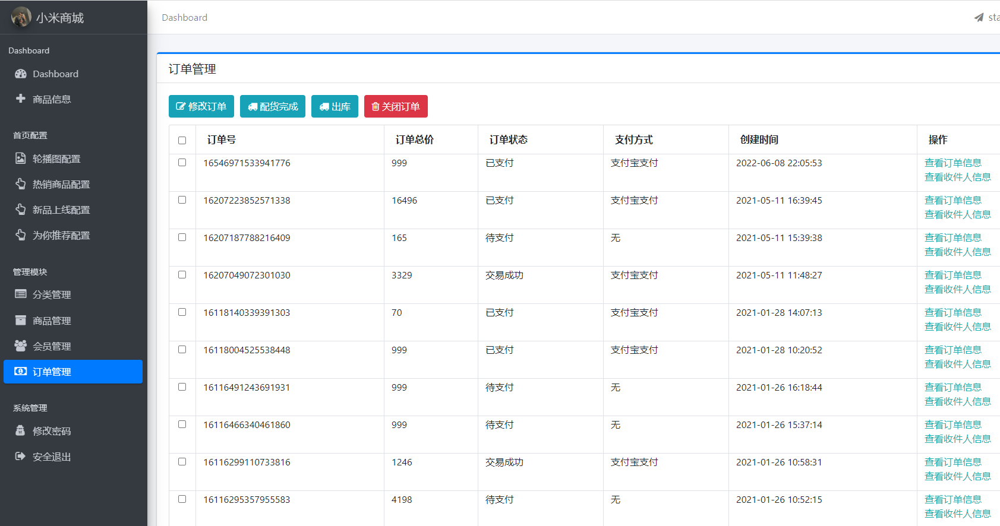

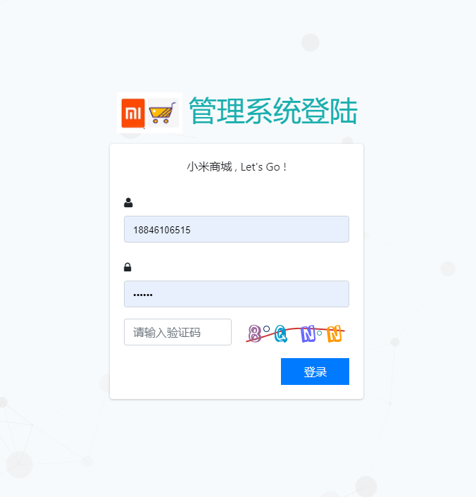

## 五、浏览地址

前台地址：http://localhost:8086/

用户名：18846106515  密码：123456

后台地址：http://localhost:8086/admin/login

用户名：admin  密码：123456

## 运行项目

文件夹 doc/temp.txt 中有详细说明。

## 六、安装教程

1、下载项目到本地并解压；
2、将项目使用IDE以maven的形式导入；
3、将数据库导入Navicat中（sql在文件夹sql/db_mall_starsea.sql）；
4、修改配置文件（application.properties）中数据库名、用户名、密码；
5、将图片文件解压到任意盘符下（图片在文件夹doc/upload.zip）；
6、修改com.siro.mall.common.Constants文件的 FILE_UPLOAD_DIC 字段，改为你解压图片的路径；
7、运行StarseaMallApplication类的main方法；
8、浏览器上访问 localhost:8080 即可。
